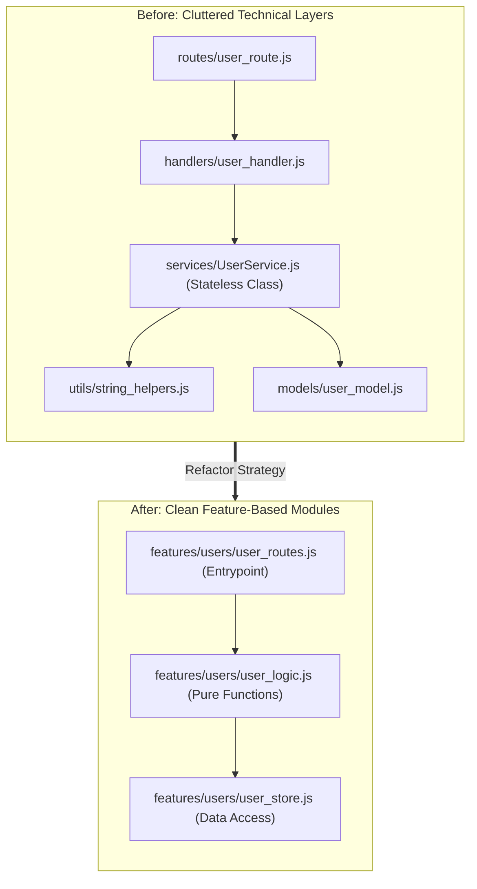
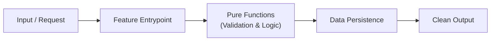

# Project Refactor Skill

This skill provides a step-by-step guide for cleaning up and restructuring code without altering its existing behavior. It helps transform complex, hard-to-navigate codebases into clean, feature-driven, and maintainable projects.

---

## Key Refactoring Principles

1. **Feature-Based Organization**: Group code by feature (routes, logic, storage) rather than technical layers (`services/`, `utils/`, `handlers/`).
2. **Pure Functions over Stateless Classes**: Remove classes that don't hold state. Replace them with simple, predictable functions that take inputs and return outputs.
3. **Remove Unnecessary Layers**: Eliminate middleman wrappers and extra steps that add no real value.
4. **Essential Safety First**: Preserve all critical checks (concurrency, data protection, crash guards).

---

## Visualizing the Proposed Structure

When proposing a refactor, include a Mermaid diagram in your plan so reviewers can immediately see how the structure improves.

### Before vs. After Overview

### Proposed Data Flow Diagram

---

## How to Use This Skill

1. Review `SKILL.md` in this directory for the full step-by-step refactoring workflow and checklist.
2. Draft a refactoring proposal with a Mermaid diagram for review.
3. Execute changes in small, verified steps and run all tests before finalizing.
